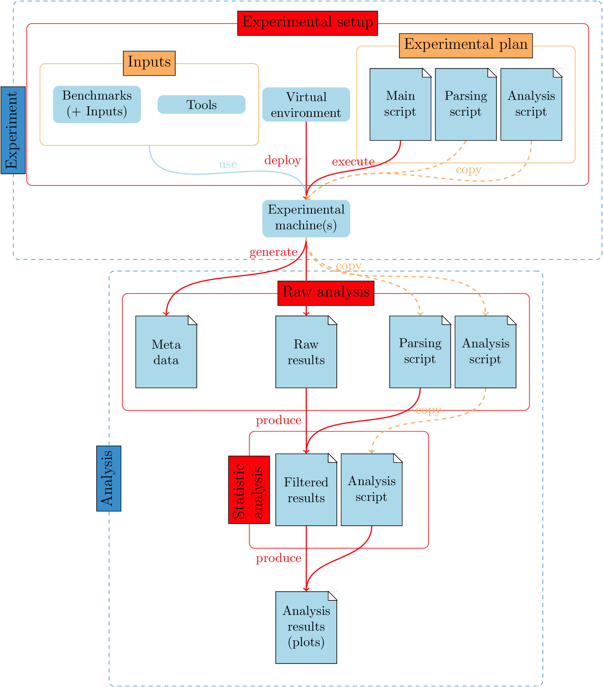

# HPDC'16 experiments

This repository provides all the requirements to reproduce the experiments
presented in the article: "Moca: An Efficient Memory Trace Collection
System" submitted at HPDC'16.

We provides three different levels of reproducibility of our experiments which
represents the diffrents steps of the [experimental pipeline](#fig:pipe):

1. **Experimental setup:**: Every thing required (except the machines) to
reproduce the whole expriment.
2. **Raw analysis**: Parse our raw traces and reproduce the complete analysis
requires only a unix with standard command and `R` installed. **Warning:** these
traces are quite heavy, it represent around 80Gib of data !
3. **Statistic analysis:** Reproduce only the final analysis, requires only
`R`.

## Analysis

Every files needed to re run the analysis (raw and statistic) are available at
zenodo:

### Statistic analysis

All the files needed to reproduce our statistic analysis are available at
zenodo:

The archive contains 3 directories:

* `Global-NAS_edel`: results of the experiment from Edel machines.
* `Global-NAS_stremi`: results of the experiment from StRemi machines.
* `Global-param`: results of the experiment on Moca parameters (Edel).

Each of these directories contains several files:

* `results.csv`: the filtred results (execution time).
* `events.csv`: the filtred results (number of pages, access, etc.).
* `analyse.rmd`: the R-markdown script used for the statisic analysis.
* `*.pdf`: the image generated included in the paper.

### Raw analysis

The following link:

contains all the archive
required for reproducing the whole raw ranalysis. To do so, first download and
extract the `raw.tgz` archive, than download and extract each other archive in
the directory `hpdc` generated by the extraction of the first one. This
directory contains a `README` explaining the file hierarchy, running
`./parse_and_plot.sh` will generate the files included in the statistic
analysis.

## Reproduce the experiment

### How-to

The experiment was run on grid5000 machines from
[Edel](https://www.grid5000.fr/mediawiki/index.php/Grenoble:Hardware#Edel)
and
[StRemi](https://www.grid5000.fr/mediawiki/index.php/Reims:Hardware#Stremi)
clusterss, respectively from Grenoble and Reims.

Please note that the NAS_* experiment are very slow: it tooks 14h on 6
machines for `NAS_edel`, and a bit more for `NAS_StRemi`.

#### If you have access to Grid5000 and Digitalis machines

To reproduce these experiemnts clone this repo then run `./init.sh`.
At this point you have everything you need to run the experiment, but you
still need to edit the files `Moca/test/perf_test_NAS_g5k.sh` and
`Moca/test/perf_test_param_g5k.sh` to update the `PREFIX` variable, it should
point to the root of this repository. You also need to set the `OWNER`
variable to your g5k username

Then you need to edit the file `jessie-nfs+gfortran.env` and put the correct
pat to `jessie.tgz` on line 10.

You can now deploy the image on one of Edel nodes and, as root, run
`~/Moca/test/perf_test_NAS_g5ksh` for the tool comparisons. Same thing on
StRemi.  For the parameter test run `sudo
~/Moca/test/perf_test_param_g5k.sh`  on an Edel machine.

#### If you don't

First you need to install an environment similar to my g5k environment. It's a
Debian Jessie the file `pkg-list` contains the list of installed packages.

Then it is necessary to install
(DynInst-8.2.1)[http://www.dyninst.org/downloads/dyninst-8.x]

Once this is done, follow the same state as for g5k user and edit the line 18
and 202 of `Moca/test/perf_test_NAS_g5k.sh` to change the test on StRemi name.

Everything should work.
